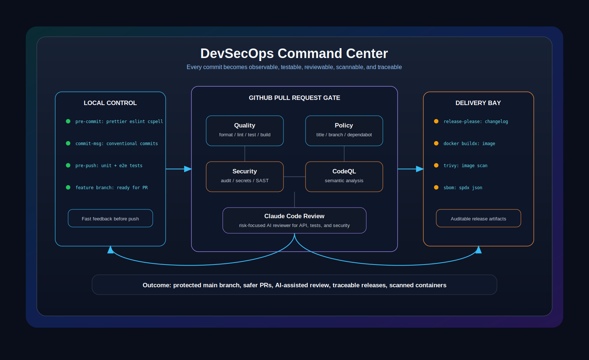

# AI DevSecOps Demo

<p align="center">
  <a href="docs/devsecops-guide.zh-CN.md"></a>
  <a href="docs/devsecops-flow.md"></a>
  <a href="https://github.com/qianfeiqianlan/ai_dev_sec_ops_demo/actions"></a>
  <a href="https://github.com/qianfeiqianlan/ai_dev_sec_ops_demo/actions/workflows/ci.yml"></a>
  <a href="https://github.com/qianfeiqianlan/ai_dev_sec_ops_demo/actions/workflows/pr-policy.yml"></a>
  <a href="https://github.com/qianfeiqianlan/ai_dev_sec_ops_demo/actions/workflows/security.yml"></a>
  <a href="https://github.com/qianfeiqianlan/ai_dev_sec_ops_demo/actions/workflows/codeql.yml"></a>
  <a href="https://github.com/qianfeiqianlan/ai_dev_sec_ops_demo/actions/workflows/ai-review.yml"></a>
  <a href="https://github.com/qianfeiqianlan/ai_dev_sec_ops_demo/actions/workflows/release.yml"></a>
  <a href="https://github.com/qianfeiqianlan/ai_dev_sec_ops_demo/actions/workflows/docker.yml"></a>
  <a href="https://github.com/qianfeiqianlan/ai_dev_sec_ops_demo/actions/workflows/image-security.yml"></a>
  <a href="https://github.com/qianfeiqianlan/ai_dev_sec_ops_demo/releases"></a>
  <a href="https://github.com/qianfeiqianlan/ai_dev_sec_ops_demo/pkgs/container/ai_dev_sec_ops_demo"></a>
</p>

This repository is a NestJS-based demo project for showing a full GitHub-driven CR/MR and CI/CD DevSecOps workflow.

The goal is to demonstrate how code moves from local development checks, through pull request quality and security gates, into release, Docker image publishing, image scanning, and supply-chain evidence.

<p align="center">
  
</p>

> Current status: this repository contains the DevSecOps demo configuration. GitHub-side workflows run after the repository is pushed and the required repository secrets/settings are configured.

## Tech Stack

- NestJS
- TypeScript
- pnpm
- Jest unit tests
- Supertest API/e2e tests
- GitHub Actions
- Docker

## DevSecOps Flow

The end-to-end flow is documented in [docs/devsecops-flow.md](docs/devsecops-flow.md).

For a Chinese beginner-friendly explanation of the full process, see [docs/devsecops-guide.zh-CN.md](docs/devsecops-guide.zh-CN.md).

At a high level, the demo is split into three gates:

- Local developer gate: fast checks before code leaves the workstation.
- Pull request gate: mandatory quality, test, security, and AI review checks before merge.
- Release gate: changelog, Docker image, image scan, SBOM, signing, and publish steps.

## Workflows

The GitHub Actions workflows are intentionally separated so each gate has a clear responsibility and can be explained independently.

| Workflow             | Trigger                                 | Purpose                                                                                                         |
| -------------------- | --------------------------------------- | --------------------------------------------------------------------------------------------------------------- |
| `ci.yml`             | Pull request, push to `main`            | Runs install, lint, unit tests, API/e2e tests, spelling checks, and coverage generation.                        |
| `pr-policy.yml`      | Pull request                            | Checks PR title, branch naming, and Conventional Commit style so project history stays release-friendly.        |
| `security.yml`       | Pull request, push to `main`, scheduled | Runs dependency vulnerability checks, secret scanning, and static analysis.                                     |
| `codeql.yml`         | Pull request, push to `main`, scheduled | Runs GitHub CodeQL for semantic code scanning.                                                                  |
| `ai-review.yml`      | Pull request                            | Uses Claude Code as an AI reviewer for risk-focused feedback on NestJS code, tests, API behavior, and security. |
| `release.yml`        | Tag or release branch                   | Generates release notes/changelog and creates a GitHub Release.                                                 |
| `docker.yml`         | Release                                 | Builds and pushes the Docker image to the container registry.                                                   |
| `image-security.yml` | Release, image publish                  | Scans the Docker image, generates an SBOM, and optionally signs the image.                                      |

## Local Quality Gates

The local development layer uses Git hooks to catch common issues early:

- `pre-commit`: format staged files, run lint on staged files, and run spelling checks.
- `commit-msg`: validate commit messages with Conventional Commits.
- `pre-push`: run unit tests and API/e2e tests before pushing.

The CI layer will always re-run important checks, because local hooks are a developer convenience rather than the final source of truth.

After cloning the repository, run `pnpm install` so the `prepare` script can enable Husky hooks locally.

## Repository Settings

To use the full remote workflow set, configure these GitHub settings:

- Add `ANTHROPIC_API_KEY` as an Actions secret for Claude Code review.
- Enable GitHub Advanced Security features if available for CodeQL and secret scanning visibility.
- Enable GitHub Packages for GHCR image publishing.
- Protect `main` or `master` and require the CI, PR policy, security, CodeQL, and AI review jobs that fit your demo.
- Allow GitHub Actions to create pull requests so release-please can open release PRs.

## Project Commands

Install dependencies:

```bash
pnpm install
```

Run the application:

```bash
pnpm run start:dev
```

Run lint:

```bash
pnpm run lint
```

Run unit tests:

```bash
pnpm run test
```

Run API/e2e tests:

```bash
pnpm run test:e2e
```

Run coverage:

```bash
pnpm run test:cov
```

## Demo Storyline

1. A developer creates a feature branch and changes a NestJS API.
2. Local Git hooks catch formatting, lint, spelling, and commit message issues.
3. The developer opens a pull request on GitHub.
4. CI validates build quality, tests, API behavior, and coverage.
5. Security workflows scan dependencies, secrets, and source code.
6. Claude Code posts an AI review focused on correctness, tests, and security risks.
7. The pull request is merged after required checks pass.
8. A release is created from `main` or a tag.
9. The release pipeline builds a Docker image, scans it, generates SBOM evidence, signs it, and publishes it.

## Implemented Configuration

- Local quality tools: `cspell`, `husky`, `lint-staged`, and `commitlint`.
- GitHub Actions workflows for CI, policy checks, dependency/security scanning, CodeQL, and Claude Code review.
- Docker multi-stage build and GHCR publishing workflow.
- Image security workflow with Trivy SARIF upload and SBOM artifact generation.
- Release automation with release-please and generated changelog/GitHub Release output.
