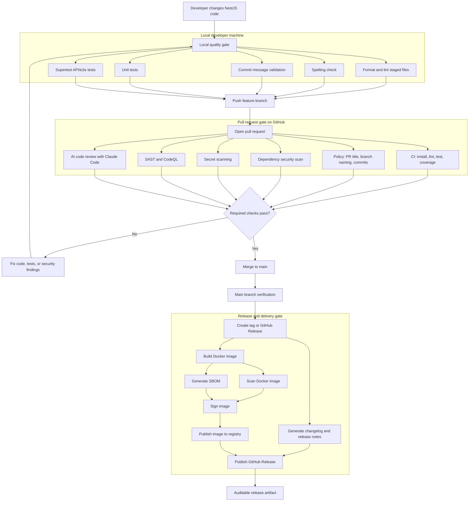
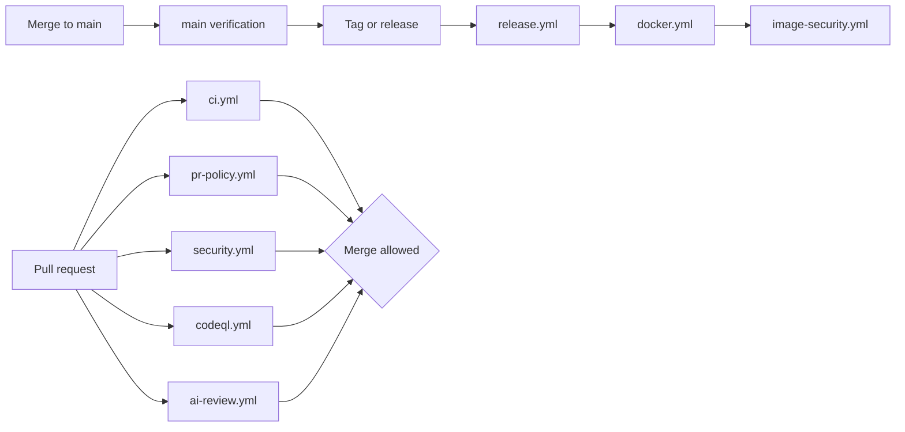

# DevSecOps Flow

This document describes the planned end-to-end CR/MR and CI/CD flow for the NestJS AI DevSecOps demo.

The design separates the pipeline into local checks, pull request checks, and release checks. That keeps the demo easy to explain and makes each gate responsible for a clear outcome.

## Full Pipeline

## Gate Responsibilities

| Gate | Purpose | Typical tools |
| --- | --- | --- |
| Local developer gate | Give developers fast feedback before pushing code. | ESLint, Prettier, cspell, Jest, Supertest, Husky, lint-staged, commitlint |
| Pull request gate | Enforce non-bypassable quality, test, policy, and security checks before merge. | GitHub Actions, pnpm, Jest, Supertest, CodeQL, Semgrep, Gitleaks, Dependabot, Claude Code |
| Release gate | Produce auditable release artifacts and container images. | release-please or semantic-release, Docker Buildx, GHCR, Trivy, Syft, Cosign |

## Planned Workflow Map

## Workflow Intent

| Workflow | Responsibility |
| --- | --- |
| `ci.yml` | Proves that the application builds cleanly and passes lint, unit tests, API/e2e tests, spelling checks, and coverage expectations. |
| `pr-policy.yml` | Keeps pull requests and commits compatible with automated releases by enforcing naming and Conventional Commit rules. |
| `security.yml` | Finds dependency vulnerabilities, leaked secrets, and common insecure coding patterns early in the pull request. |
| `codeql.yml` | Provides GitHub-native semantic static analysis for TypeScript and JavaScript code. |
| `ai-review.yml` | Adds Claude Code feedback for correctness, test gaps, API behavior, error handling, and security-sensitive changes. |
| `release.yml` | Creates changelog/release notes and publishes the GitHub Release. |
| `docker.yml` | Builds and publishes the application container image. |
| `image-security.yml` | Scans the image, generates SBOM evidence, and signs the published image when configured. |

## Demo Principles

- Local hooks optimize developer experience, but GitHub Actions remain the source of truth.
- Heavy checks should run remotely so local commits stay fast.
- Security checks should be visible in pull requests, not hidden until release time.
- AI review should assist human reviewers rather than replace required deterministic checks.
- Release artifacts should be traceable: source commit, changelog, image digest, scan result, SBOM, and signature should line up.
